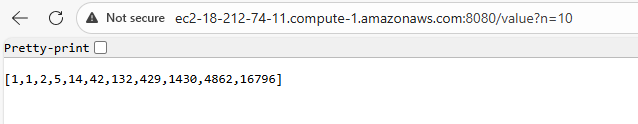

# Parcial-TDSE-2

## Creacion de las dos instancias en AWS:

## Creacion de la instancia proxy:

## Funcionamiento en la terminal:

## Prueba en Local:

Comando: mvn spring-boot:run

## Como se subio a EC2:

Entramos a la instancia con ssh.

En intellij usamos mvn clean package para generar el .jar del proyecto.

Ese jar lo subimos a la instancia con el comando scp:

$ scp -i PATATA.pem PARCIAL-TDSE-2/target/rest-service-complete-0.0.1-SNAPSHOT.jar ec2-user@ec2-18-212-74-11.compute-1.amazonaws.com:~

Y dentro de la instancia lo ejecutamos con el comando:

$ java -jar rest-service-complete-0.0.1-SNAPSHOT.jar

## Prueba en EC2:

Video con html: https://youtu.be/sIcnDFIzcgQ?si=fh0fIQguyln1Gua8
